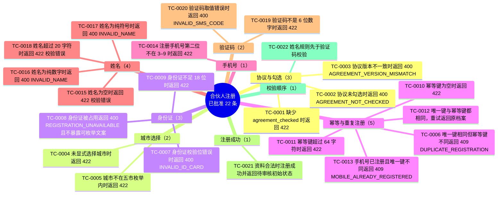

# 合伙人注册用例脑图（已批准 22 条）

```mermaid
mindmap
  root((合伙人注册<br/>已批准 22 条))
    协议与勾选（3）
      TC-0001 缺少 agreement_checked 时返回 422
      TC-0002 协议未勾选时返回 400 AGREEMENT_NOT_CHECKED
      TC-0003 协议版本不一致时返回 400 AGREEMENT_VERSION_MISMATCH
    城市选择（2）
      TC-0004 未显式选择城市时返回 422
      TC-0005 城市不在五市枚举内时返回 422
    身份证（3）
      TC-0007 身份证校验位错误时返回 400 INVALID_ID_CARD
      TC-0008 身份证被占用返回 400 REGISTRATION_UNAVAILABLE 且不暴露可枚举文案
      TC-0009 身份证不足 18 位时返回 422
    幂等与重复注册（5）
      TC-0006 唯一键相同但幂等键不同返回 409 DUPLICATE_REGISTRATION
      TC-0010 幂等键为空时返回 422
      TC-0011 幂等键超过 64 字符时返回 422
      TC-0012 唯一键与幂等键都相同，重试返回原档案
      TC-0013 手机号已注册且唯一键不同返回 409 MOBILE_ALREADY_REGISTERED
    手机号（1）
      TC-0014 注册手机号第二位不在 3–9 时返回 422
    姓名（4）
      TC-0015 姓名为空时返回 422 校验错误
      TC-0016 姓名为纯数字时返回 400 INVALID_NAME
      TC-0017 姓名为纯符号时返回 400 INVALID_NAME
      TC-0018 姓名超过 20 字符时返回 422 校验错误
    验证码（2）
      TC-0019 验证码不是 6 位数字时返回 422
      TC-0020 验证码取值错误时返回 400 INVALID_SMS_CODE
    注册成功（1）
      TC-0021 资料合法时注册成功并返回待审核初始状态
    校验顺序（1）
      TC-0022 姓名规则先于验证码校验
```

> 结构：主题 → 用例；节点文本为 `用例ID + 标题`。
> 可在支持 Mermaid 的 Markdown 预览器中渲染，或配合 `cases.approved.mindmap.svg` 查看。
